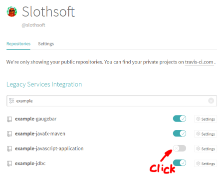

# Example JavaScript Website

[](http://opensource.org/licenses/MIT) [](https://travis-ci.org/slothsoft/example-javascript-website)

- **Author:** [Stef Schulz](mailto:s.schulz@slothsoft.de)
- **Repository:** <https://github.com/slothsoft/example-javascript-website>
- **Open Issues:** <https://github.com/slothsoft/example-javascript-website/issues>
- **Website:** [http://app.slothsoft.de](http://app.slothsoft.de/example-javascript-website)

An example for setting up a static HTML website using well tested JavaScript:


**Content:**
- [Preface](#preface)
- [0. Setup Environment](#0-setup-environment)
- [1. Dependency Management](#1-dependency-management)
- [2. Transpile Code](#2-transpile-code)
- [3. Tests](#3-tests)
- [4. Create Website](#4-create-website)
- [5. Deploy Finished Product](#5-deploy-finished-product)
- [6. Hook to CI Server](#6-hook-to-ci-server)
  - [Why is it important to use a CI server?](#why-is-it-important-to-use-a-ci-server)
- [7. Localization](#7-localization)
- [Conclusion](#conclusion)
  - [Questions](#questions)
  - [External Links](#external-links)


# Preface

Let me preface this document by saying: I'm not a JavaScript developer. I don't *want* to be a JavaScript developer. I've over ten years in Java and I don't plan to change that any time soon. 

But I'm a firm believer of using the right tool for the job, so I'm trying to learn how to swing the JavaScript pocket knife, just in case I need something different than my Java hammer someday.

I was sorely disappointed to learn there is evidently no standard environment to develop JavaScript, so I'm trying to figure out how to do it on my own.

For Java the de facto standard is to use Maven, which does the following:

1. Manage dependencies
2. Compile the code
3. Test
4. Create a distribution (JAR for Java)
5. Deploy the finished product
6. Run on CI server

So I figure the same is needed for a JavaScript project (except we don't need a compiler, but maybe a transpiler (to create older code that is supported by more browsers) and / or a minimizer (to strip whitespaces and stuff like that)).

So that's what I'm trying to get into this environment.

Oh, and localization, even though that's a plain Java feature and not Maven. But it's needed for every application. Note that this is no tutorial, it's a diary where I try to understand what I'm doing.

So let's go!


# 0. Setup Environment

The only thing almost everyone seems to agree on is that we need NodeJS. You can get it from [nodejs.org](https://nodejs.org/en/). NodeJS let's you run JavaScript outside of the browser. Which can be used to create JavaScript servers (I've yet to find out why that would be a *good* idea) or of course for executing tests.

So if you've installed NodeJS correctly you should get the following output on the command line:

```
>node --version
v10.16.3
```


# 1. Dependency Management

For this setup dependency management is done by NodeJS's very own package manager: npm.

It should be available if NodeJS is installed, so check that by using the command line:

```
>npm --version
6.11.2
```

Since npm updates more frequently than NodeJS it's probable this version is outdated. Use this to update:

```
npm install npm@latest -g
```

So now we can create a project:

```
mkdir example
cd example
npm init
```

npm will now play twenty questions with you, but you can just press enter to use the defaults.

This will generate a file _package,json_. A basic one looks something like this:

```json
{
  "name": "example",
  "version": "1.0.0",
  "description": "My first project",
  "main": "index.js",
  "scripts": {
    "test": "echo \"Error: no test specified\" && exit 1"
  },
  "author": "Stef Schulz <s.schulz@slothsoft.de>",
  "license": "MIT"
}

```

You can see my _[package.json](package.json)_ for a more comprehensive example. Although maybe finish reading this document first, some properties will be explained.


# 2. Transpile Code 

So evidently NodeJS is only for creating server applications with JavaScript. Maybe I'll tackle this later but right now I want to create a simple website. 

So... simple website, right? I created a small HTML page ([index.html](dist/index.html)), a very basic CSS file ([style.css](dist/resources/css/style.css)) and copied an image from my last vacation ([image](dist/resources/images/DSC00372.jpg)). The structure of the project is from [appcropolis](http://appcropolis.com/blog/web-technology/organize-html-css-javascript-files/):


Check out the HTMl file. The important line is the following:

```html
<b>Price for Family:</b> $<span id="family-price"></span>
```

It gives us an entry point for our JavaScript. Speaking of which I created a file _[src/box-office.js](src/box-office.js)_ with a legendary algorithm:

```js
function calculatePrice(personCount) {
	return 80.0 * personCount;
}
```

And now I want to somehow get the result of the function into my HTML. So far everything's pretty standard, but now we'll work with NodeJS.

NodeJS wants to have an actual application that does stuff, so let's create a  _[src/main.js](src/main.js)_:


```js
var calculatePrice = require('./box-office.js')

document.getElementById('family-price').innerHTML = calculatePrice(4);
```

Now how do we get the NodeJS application into our nice little website? The answer is:  [browserify](https://github.com/browserify/browserify).

We'll install it via command line:

```
npm install --save-dev browserify
```

(The tutorial on the browserify page suggests using `npm install -g browserify` to install it globally. For me the above worked better for some reason.)

During the execution of the above command line the following happens:

1. npm creates a file _[package-lock.json](package-lock.json)_ that contains all dependencies; it also tells us `You should commit this file.` (but most modules I saw on GitHub still don't)
1. a folder _node&#x5f;modules/_ is created; this folder contains the dependencies as NodeJS modules; there is no reason to commit this folder, since you can generate it from the _package-lock.json_

Next we'll create a script in the _package.json_ file that bundles our "main" application into a file "bundle.js":

```json
  "scripts": {
    "bundle": "browserify src/main.js -o dist/resources/js/bundle.js",
  }
```

Run it via `npm browserify` and voilá: we have everything bundled nicely. We'll just add the script into our HTML page via the following line:

```html
<script src="resources/js/bundle.js"></script>
```

(I found out the hard way that this only works directly before the closing `</body>` tag.)


 
Isn't it nice?

But wait... the _bundle.js_ is still very big. So we'll add another module to minimize it, [Butternut](https://github.com/Rich-Harris/butternut).

```
npm install --save-dev butternut
```

(I'll keep adding these modules locally, because I have no idea why that would be a bad idea.)

And then we extent the script:

```json
  "scripts": {
    "bundle": "browserify src/main.js | squash > dist/resources/js/bundle.js",
  }
```

Even for such a small application this step saved us over 100 bytes (16% of the length of the file). 

So all is good but it's really annoying to create the _bundle.js_ by hand. We'll just add another bundle to do this for us: [watchifiy](https://www.npmjs.com/package/watchify).

We'll install it via:

```
npm install --save-dev watchify
```

And we'll add another script:

```json
  "scripts": {
    "bundle": ...
    "watch": "watchify src/main.js -o dist/resources/js/bundle.js -v"
  }
```

Run it via `npm watch` and you'll see the following anytime you change one of the files in _src/_:

```
860 bytes written to dist/resources/js/bundle.js (0.03 seconds) at 22:14:09
860 bytes written to dist/resources/js/bundle.js (0.01 seconds) at 22:14:18
860 bytes written to dist/resources/js/bundle.js (0.01 seconds) at 22:14:20
```

If you don't like the output, remove "-v" from the above script.

So now we're able to create a tightly packaged _bundle.js_ and are able to recreate it on any change of the source files. Nice.


# 3. Tests

For creating tests I used [QUnit](https://qunitjs.com/) because it looked simple. As with everything here there are a bunch of options around. I've personally worked with [jasmine](https://jasmine.github.io/) and [mocha](https://mochajs.org/) as well.

Using QUnit the tests for the legendary algorithm™ look like this:

```js
QUnit.module("calculatePrice()", function() {
	QUnit.test("for 0 persons", function(assert) {
		assert.equal(calculatePrice(0), 0.0);
	});
	QUnit.test("for 1 person", function(assert) {
		assert.equal(calculatePrice(1), 80.0);
	});
	QUnit.test("for 2 persons", function(assert) {
		assert.equal(calculatePrice(2), 160.0);
	});
	// ...
});
```

For me the most problematic part was the definition of equal: [equal(actual, expected)](https://api.qunitjs.com/assert/equal). Because I'm used to writing it the other way around (expected, then actual). 

If you copy the QUnit example HTML page you can even see the tests work:

```html
<!DOCTYPE html>
<html>
<head>
	<meta charset="utf-8">
	<meta name="viewport" content="width=device-width">
	<title>QUnit Example</title>
	<link rel="stylesheet" href="https://code.jquery.com/qunit/qunit-2.9.2.css">
</head>
<body>
	<div id="qunit"></div>
	<div id="qunit-fixture"></div>
	<script src="https://code.jquery.com/qunit/qunit-2.9.2.js"></script>
	<script src="../src/box-office.js"></script>
	<script src="../test/box-office-test.js"></script>
</body>
</html>
```

(Example for a file _dist/test.html_)

The result looks something like this:


But we know if a human has to check the tests, then the human will become the problem, so I'd rather have the build process check the tests.

First we want to install QUnit to the project using this command line:

```
npm install --save-dev qunit
```

After the installation it's time to tell the project to run QUnit as test, so we'll change the following lines of the _package.json_:

```json
  "scripts": {
    "bundle": ...
    "watch": ...
    "test": "qunit"
  }
```

If we run that now via `npm test` you'll get the following error:

```
ReferenceError: calculatePrice is not defined
```

It's clear that the test doesn't know the file with the  legendary algorithm™, so we'll add:

```js
calculatePrice = require('../src/box-office.js')
```

...and export the corresponding method:

```js
module.exports = function calculatePrice(personCount) {
	return 80.0 * personCount;
}
```

(**Note:** If you followed this step by step then the _dist/test.html_ will stop working after these two changes, because `require()` and `module.exports` are NodeJS functions.)

Execute the tests again using npm and you'll get something like that:

```
TAP version 13
ok 1 calculatePrice() > for 0 persons
ok 2 calculatePrice() > for 1 person
ok 3 calculatePrice() > for 2 persons
ok 4 calculatePrice() > for 3 persons
1..4
# pass 4
# skip 0
# todo 0
# fail 0
```

So tests now work.


# 4. Create Website

Since we deploy the website directly to the server we don't need to do something special here. Our script "bundle" already creates a nice working website in the _dist/_ folder.


# 5. Deploy Finished Product

So now we have a website ready to deploy. We want to deploy it to a server, but what else do we want?

1. Test the code (stop if there are errors)
1. Bundle the code (because "watch" doesn't minify the code)
1. Deploy

We can already do the first two. So let's tackle the last one.

FTP is standard for Windows, so I used this for now ( [ftp-deploy](https://github.com/simonh1000/ftp-deploy) didn't work for me (`ENOTFOUND`)).

I use `ftp -s:deploy.txt` on the command line to run this script ([deploy.txt](deploy.txt)):

```
open <my-website.de>
<username>
<password>

lcd ./dist
prompt

cd /htdocs/
mkdir example-javascript-website
cd example-javascript-website
mput *.html

mkdir resources
cd resources
lcd resources

mkdir css
cd css
lcd css
mput *.css
cd ..
lcd ..

mkdir images
cd images
lcd images
mput *.*
cd ..
lcd ..

mkdir js
cd js
lcd js
mput *.js
cd ..
lcd ..

bye
```

This script is incredible complicated even for a website this small, so you should probably replace this with another FTP client.


# 6. Hook to CI Server

Before letting a CI server do anything to the code, we need to commit it. You can use this handy [.gitignore template for NodeJS](https://github.com/github/gitignore/blob/master/Node.gitignore) to figure out what to commit.

Hooking the project to a CI server is incredibly easy for GitHub projects. That's why I love [Travis](https://travis-ci.org/).

You only create a file _.travis.yml_:

```
language: node_js
node_js:
  - "stable"
  - "10"
```

The entries below "node_js" tell Travis which NodeJS versions to test against. For simplicity's sake I'll use 10 (the current long term support) and the last stable version (currently 12).

On default Travis executes `npm test`, which works nicely for us. 

Log into Travis using your GitHub account, search your repository in your list and enable it: 



That's it. You can trigger a build manually or wait for Travis to react to a commit. 

The output will be the same as for the regular test runs. You can find this project's Travis configuration [here](https://travis-ci.org/slothsoft/example-javascript-website).

## Why is it important to use a CI server? 

- You can check if your code (and development environment) has dependencies to something that's just on your machine, e.g. when I added Travis I found out I was still missing some dependencies 
- Checks that the code in your repository still works, even if you forgot to run some of the tests (or _all_ the tests)
- If you work with others, frequent feedback from the tests allows for bugs to be found much sooner, so that the original author might still be able to fix them
- You can test the code against different versions of dependencies 
- And really, if you can automate some tasks, why wouldn't you? Tedious tasks like deploying to a development server should be done by a CI server.


# 7. Localization

To localize the app I used [localizify](https://github.com/noveogroup-amorgunov/localizify), because it has no other dependencies:

```
npm install localizify --save
```

Note that this is the first time a dependency is added to the property "dependencies" instead of "devDependencies" in the _package.json_ file.

The tutorial for localizify is pretty straight forward. Since I don't really want to complicate my small HTML page, I added the localization only for the currency symbol.

So the JSON files for translating look like this:

[en.json](en.json):

```json 
{
  "currency": "${value}",
}
```

[de.json](de.json) (or any other EU country): 

```json
{
  "currency": "{value} €",
}
```

I created another JavaScript file to include these messages files (so that the test can use them as well) inside the file - _[src/init-i18n.js](src/init-i18n.js)_: 

```js
const localizify = require('localizify');

const en = require('./messages/en.json');
const de = require('./messages/de.json');

localizify.add('en', en).add('de', de);

var userLang = navigator.language || navigator.userLanguage; 
localizify.setLocale(userLang);

module.exports = localizify;
```

And finally copied our legendary algorithm™ and its test so I can create versions with localization:

- _[src/international-box-office.js](src/international-box-office.js)_
- _[test/international-box-office-test.js](test/international-box-office-test.js)_

So now we can open two versions of the website:


Left a German browser, right an American English one. 


# Conclusion

So now I've created a working environment to create a static HTML website with well tested NodeJS JavaScript.  And if you followed this guide you might have, too. Or you can just download this repository if you like. I bet I will in the future. 

If you find mistakes of any kind just [write me an email](mailto:s.schulz@slothsoft.de) or [raise an issue](<https://github.com/slothsoft/example-javascript-website/issues>). I love to learn new stuff, so I'll be thrilled to hear from you! 


## Questions

**Every time I install a new module, _package-lock.json_ will get scrambled and random previous installed modules will vanish. Why?**

I assume this has to do with the following question. The dependencies were missing from the _package.json_, so they weren't taking into account for the generation of the _package-lock.json_.


**Some modules inserted themselves into _package.json_ -> "dependencies" or "devDependencies". Most didn't. Why?**

Sometimes there is the following warning during the installation:

```
npm WARN saveError EPERM: operation not permitted, rename 'S:\path\to\project\package.json.3710518402' -> 'S:\path\to\project\package.json'
```

(Which really, _really_ should be an error, because it prevents the dependency from being permanent.)

In my case the folder _node&#x5f;modules/_ was set to read only. After removing that flag the above warning vanished and the dependency was added to the _package.json_ file correctly.


## External Links

I've read a lot of stuff to come this far (which is not very far to be sure), but here are some of my resources:

- [Configuring a basic environment for JavaScript development](https://italonascimento.github.io/configuring-a-basic-environment-for-javascript-development/)
- [How to Build a reusable Javascript development environment.](https://medium.com/the-andela-way/how-to-build-a-reusable-javascript-development-environment-f13146b77fdf)
- [A crash course on testing with Node.js](https://hackernoon.com/a-crash-course-on-testing-with-node-js-6c7428d3da02)
- [How to organize your HTML, CSS, and Javascript files](http://appcropolis.com/blog/web-technology/organize-html-css-javascript-files/)

Used modules and other resources:

- [browserify on GitHub](https://github.com/browserify/browserify)
- [Butternut](https://github.com/Rich-Harris/butternut)
- [watchifiy](https://www.npmjs.com/package/watchify)
- [QUnit](https://qunitjs.com/)
- [.gitignore Template for NodeJS](https://github.com/github/gitignore/blob/master/Node.gitignore)
- [Travis](https://travis-ci.org/)
- [localizify](https://github.com/noveogroup-amorgunov/localizify)
