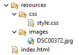
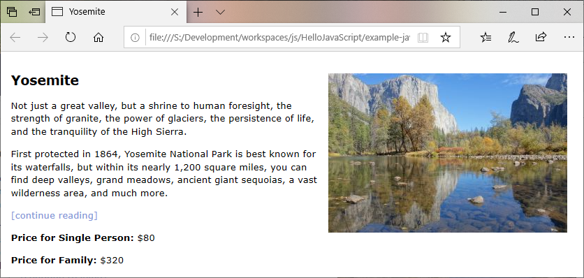
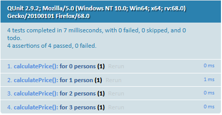

# [WIP] Example JavaScript Application

_WIP means I have no idea what I'm doing right now. Or if it makes sense. I hope when I'm finished I will have learned both._

**Content:**
- [Preface](#preface)
- [0. Setup Environment](#0-setup-environment)
- [1. Dependency Management](#1-dependency-management)
- [2. Transpile Code](#2-transpile-code)
- [3. Tests](#3-tests)
- [4. Create WebApp](#4-create-webapp)
- [5. Deploy Finished Product](#5-deploy-finished-product)
- [6. Hook to CI Server](#6-hook-to-ci-server)
- [7. Localization](#7-localization)
- [Conclusion](#conclusion)
  - [ External Links](#external-links)


# Preface

Let me preface this tutorial by saying: I'm not a JavaScript developer. I don't *want* to be a JavaScript developer. I've over ten years in Java and I don't plan to change that any time soon. 

But I'm a firm believer of using the right tool for the job, so I'm trying to learn how to swing the JavaScript pocket knife, just in case I need something different than my Java hammer someday.

I was sorely disappointed to learn there is evidently no standard environment to develop JavaScript, so I'm trying to figure out how to do it on my own.

For Java the de facto standard is to use Maven, which does the following:

1. Manage dependencies
2. Compile the code
3. Test
4. Create a distribution (JAR for Java)
5. Deploy the finished product
6. Run on CI server

So I figure the same is needed for a JavaScript project (except we don't need a compiler, but maybe a transpiler (to create older code that is supported by more browsers) and / or a minimizer (to strip whitespaces and stuff like that)).

So that's what I'm trying to get into this environment.

Oh, and localization, even though that's a plain Java feature and not Maven. But it's needed in every application.

So let's go!


# 0. Setup Environment

The only thing almost everyone seems to agree on is that we need NodeJS. You can get it from [nodejs.org](https://nodejs.org/en/). NodeJS let's you run JavaScript outside of the browser. Which can be used to create JavaScript servers (I've yet to find out why that would be a *good* idea) or of course for executing tests.

So if you've installed NodeJS correctly you should get the following output on the command line:

```
>node --version
v10.16.3
```


# 1. Dependency Management

For this setup dependency management is done by NodeJS's very own package manager: npm.

It should be available if NodeJS is installed, so check that by using the command line:

```
>npm --version
6.11.2
```

Since npm updates more frequently than NodeJS it's probable this version is outdated. Use this to update:

```
npm install npm@latest -g
```

So now we can create a project:

```
mkdir example
cd example
npm init
```

npm will now play twenty questions with you, but you can just press enter to use the defaults.

This will generate a file _package,json_. A basic one looks something like this:

```json
{
  "name": "example",
  "version": "1.0.0",
  "description": "My first project",
  "main": "index.js",
  "scripts": {
    "test": "echo \"Error: no test specified\" && exit 1"
  },
  "author": "Stef Schulz <s.schulz@slothsoft.de>",
  "license": "MIT"
}

```

You can see my _[package.json](package.json)_ for a more comprehensive example. Although maybe finish reading this document first, some properties will be explained.


# 2. Transpile Code 

So evidently NodeJS is only for creating server applications with JavaScript. Maybe I'll tackle this later but right now I want to create a simple website. 

So... simple website, right? I created a small HTML page ([index.html](dist/index.html), a very basic CSS file ([style.css](dist/resources/css/style.css) and copied an image from my last vacation ([image](dist/resources/images/DSC00372.jpg)). The structure of the project is from [appcropolis](http://appcropolis.com/blog/web-technology/organize-html-css-javascript-files/):



Check out the HTMl file. The important line is the following:

```html
<b>Price for Family:</b> $<span id="family-price"></span>
```

It gives us an entry point for our JavaScript. Speaking of which I created a file _[src/box-office.js](src/box-office.js)_ with a legendary algorithm:

```js
function calculatePrice(personCount) {
	return 80.0 * personCount;
}
```

And now I want to somehow get the result of the function into my HTML. So far everything's pretty standard. But now we'll work with NodeJS.

NodeJS wants to have an actual application that does stuff, so let's create a  _[src/main.js](src/main.js)_:


```js
var calculatePrice = require('./box-office.js')

document.getElementById('family-price').innerHTML = calculatePrice(4);
```

Now how do we get the NodeJS application into our nice little website? The answer is:  [browserify](https://github.com/browserify/browserify).

We'll install it via command line:

```
npm install --save-dev browserify
```

(The tutorial on the browserify page suggests to use `npm install -g browserify` to install it globally. For me the above worked better for some reason.)

During the execution of the above command line the following happens:

1. npm creates a file _[package-lock.json](package-lock.json)_ that contains all dependencies; it also tells us `You should commit this file.` (so we probably should)
1. a folder _node&#x5f;modules/_ is created; this folder contains the dependencies as NodeJS modules; there is no reason to commit this folder, since you can generate it from the _package-lock.json_

Next we'll create a script in the _package.json_ file that bundles our "main" application into a file "bundle.js":

```json
  "scripts": {
    "bundle": "browserify src/main.js -o dist/resources/js/bundle.js",
  }
```

Run it via `npm browserify` and voilá: we have everything bundled nicely. We'll just add the script into our HTML page via the following line:

```html
<script src="resources/js/bundle.js"></script>
```

(I found out the hard way that this only works directly before the closing `</body>` tag.)


 
Isn't it nice?


# 3. Tests

For creating tests I used [QUnit](https://qunitjs.com/) because it looked simple.

And indeed for the legendary algorithm™ the tests look like this:

```js
QUnit.module("calculatePrice()", function() {
	QUnit.test("for 0 persons", function(assert) {
		assert.equal(calculatePrice(0), 0.0);
	});
	QUnit.test("for 1 person", function(assert) {
		assert.equal(calculatePrice(1), 80.0);
	});
	QUnit.test("for 2 persons", function(assert) {
		assert.equal(calculatePrice(2), 160.0);
	});
	// ...
});
```

For me the most problematic part was the definition of equal: [equal(actual, expected)](https://api.qunitjs.com/assert/equal). Because I'm used to writing it the other way around (expected, then actual). 

If you copy the QUnit example HTML page you can even see the tests work:

```html
<!DOCTYPE html>
<html>
<head>
	<meta charset="utf-8">
	<meta name="viewport" content="width=device-width">
	<title>QUnit Example</title>
	<link rel="stylesheet" href="https://code.jquery.com/qunit/qunit-2.9.2.css">
</head>
<body>
	<div id="qunit"></div>
	<div id="qunit-fixture"></div>
	<script src="https://code.jquery.com/qunit/qunit-2.9.2.js"></script>
	<script src="../src/box-office.js"></script>
	<script src="../test/box-office-test.js"></script>
</body>
</html>
```

(Example for a file _dist/test.html_)

The result looks something like this:



But we know if a human has to check the tests, then the human will become the problem, so I'd rather have the build process check the tests.

First we want to install QUnit to the project using this command line:

```
npm install --save-dev qunit
```

After the installation it's time to tell the project to run QUnit as test, so we'll change the following lines of the _package.json_:

```json
  "scripts": {
  	 "bundle": ...
    "test": "qunit"
  }
```

If we run that now via `npm test` you'll get the following error:

```
ReferenceError: calculatePrice is not defined
```

It's clear that the test doesn't know the file with the  legendary algorithm™, so we'll add:

```js
calculatePrice = require('../src/box-office.js')
```

...and export the corresponding method:

```js
module.exports = function calculatePrice(personCount) {
	return 80.0 * personCount;
}
```

(**Note:** If you followed this step by step then the _index.html_ will stop working after these two changes, because `require()` and `module.exports` are NodeJS functions.)

Execute the tests again using npm and you'll get something like that:

```
TAP version 13
ok 1 calculatePrice() > for 0 persons
ok 2 calculatePrice() > for 1 person
ok 3 calculatePrice() > for 2 persons
ok 4 calculatePrice() > for 3 persons
1..4
# pass 4
# skip 0
# todo 0
# fail 0
```

So tests now work.


# 4. Create WebApp


# 5. Deploy Finished Product


# 6. Hook to CI Server

Before letting a CI server do anything to the code, we need to commit it. You can use this handy [.gitignore template for NodeJS](https://github.com/github/gitignore/blob/master/Node.gitignore) to figure out what to commit.

[...more...]


# 7. Localization


# Conclusion

## External Links

I've read a lot of stuff to come this far (which is not very far to be sure), but here are some of my resources:

- [Configuring a basic environment for JavaScript development](https://italonascimento.github.io/configuring-a-basic-environment-for-javascript-development/)
- [How to Build a reusable Javascript development environment.](https://medium.com/the-andela-way/how-to-build-a-reusable-javascript-development-environment-f13146b77fdf)
- [A crash course on testing with Node.js](https://hackernoon.com/a-crash-course-on-testing-with-node-js-6c7428d3da02)
- [.gitignore Template for NodeJS](https://github.com/github/gitignore/blob/master/Node.gitignore)
- [browserify on GitHub](https://github.com/browserify/browserify)
- [How to organize your HTML, CSS, and Javascript files](http://appcropolis.com/blog/web-technology/organize-html-css-javascript-files/)
- [QUnit](https://qunitjs.com/)
